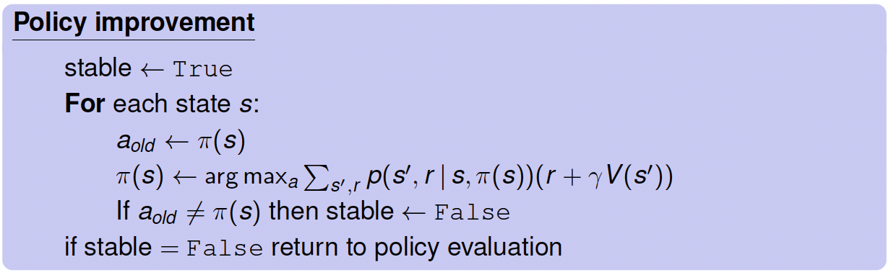
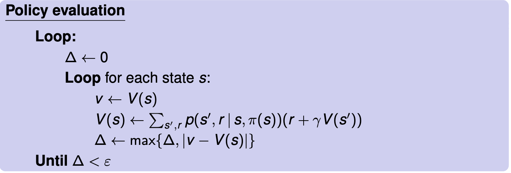
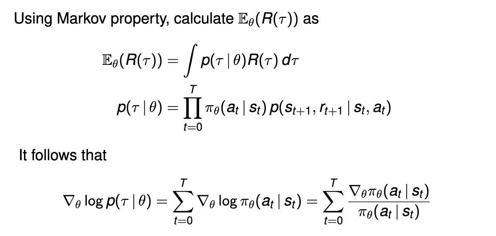
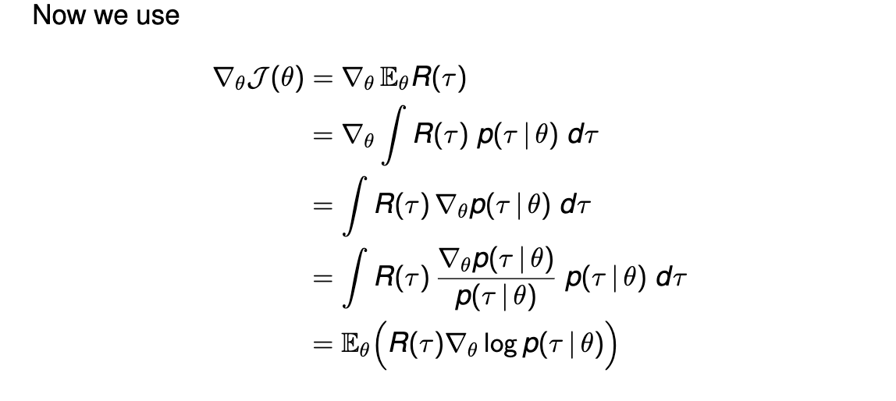
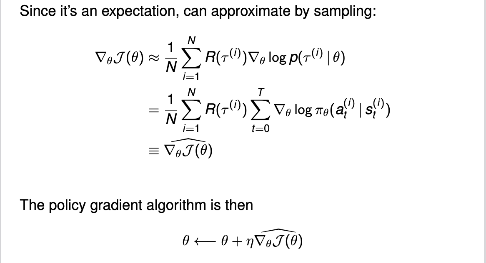

# Reinforcement Learning Policy Methods

## 1. Concepts of RL

*Policy*: A mapping from states to actions. An algorithm/rule to make decisions at each time step, designed to maximize the long-term
reward.

*Value function*: A mapping from states to total reward. The total reward the agent can expect to accumulate in the future, starting from that state (if they are making optimal decisions).

*Q-function*: A mapping from states and actions to total reward.

## 2. Principle: Bellman Equation

- Value function optimality:

$v_*(s) = \max_a \mathbb{E}[R_{t+1} + \gamma v_*(S_{t+1}) | S_t = s, A_t = a]$

- Q-function optimality:

$Q_*(s,a) = \mathbb{E}[R_{t+1} + \gamma \max_{a'} Q_*(S_{t+1}, a') | S_t = s, A_t = a]$

> Algorithm:
> 1. Initialize $Q(s,a)$ for all $s\in S$ and $a\in A(s)$
> 2. For each episode:
>    - Initialize $s$
>    - Choose $a$ using policy derived from $Q$ (e.g., $\epsilon$-greedy)
>    - Take action $a$, observe $r, s'$
>    - Update $Q(s,a) \leftarrow Q(s,a) + \alpha [r + \gamma \max_{a'} Q(s', a') - Q(s,a)]$
>    - $s \leftarrow s'$
> 3. Until $s$ is terminal

## 3. Deep Reinforcement Learning

- Deep Q-Learning

**Strategy**:

Objective:
$Q(s, a; \theta) = \mathbb{E}[R_{t+1} + \gamma \max_{a'} Q(S_{t+1}, a'; \theta) | S_t = s, A_t = a]$

Let $y_t$ be one step of "play":
$y_t = R_{t+1} + \gamma \max_{a'} Q(S_{t+1}, a'; \theta_{old})$

Adjust the parameters $\theta$ to make the squared error small (SGD):
$(y_t - Q(s, a; \theta))^2$

Conduct SGD using backpropagation:

$\theta \leftarrow \theta + \eta (y_t - Q(s,a;\theta)) \nabla_\theta Q(s,a;\theta)$

- Repplay buffer
- Automatic differentiation: Gradient Collection

## 4. Policy Iteration

- Policy evaluation:

- Policy improvement:

## 5. Policy Gradient Methods

- Parameterize the policy: $\pi_\theta(s)$ 
    > Policy is probability distribution $\pi_\theta(a \vert s)$ over action $a$ given state $s$

- Loss function: Expected reward $\mathbb{J}(\theta) = \mathbb{E}[R]$

    > Let $\tau$ be a trajectory sequence: 
    > $(s_0,a_0) \rightarrow (s_1,r_1,a_1) \rightarrow (s_2,r_2,a_2) \rightarrow \cdots \rightarrow (s_T,r_T,a_T) \rightarrow s_{T+1}$, where $s_{T+1}$ is a terminal state.
    >
    > The objective function $\mathcal{J}(\theta)$ is defined as:
    > $$\mathcal{J}(\theta) = \mathbb{E}_\theta[R(\tau)] = \mathbb{E}_\theta\left[\sum_{t=1}^T r_t\right]$$
    > 

- Calculating the gradient:
    > 
    > 
- Approximating the gradient:
    > 

